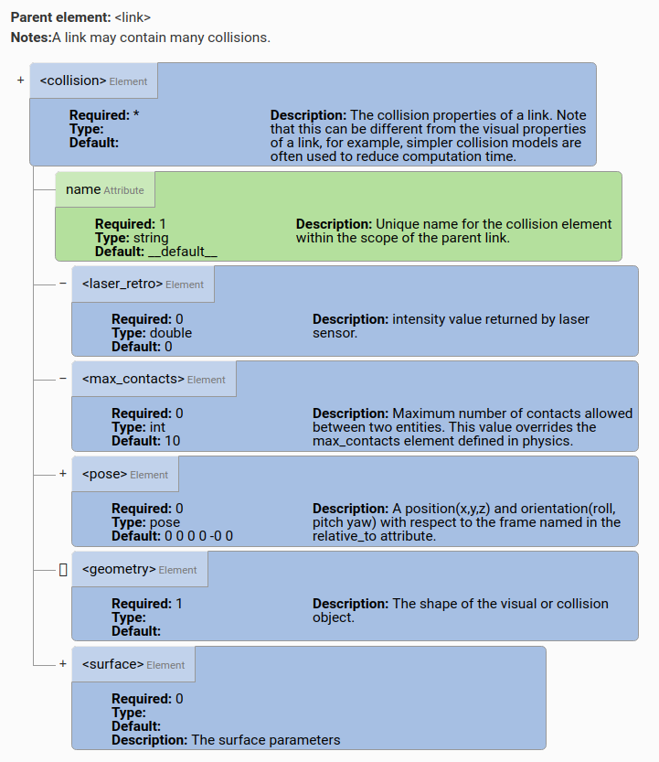
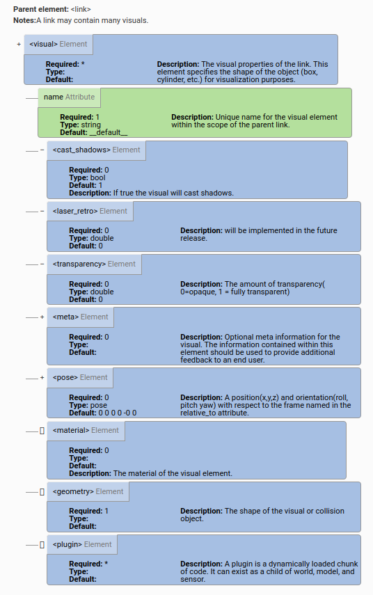
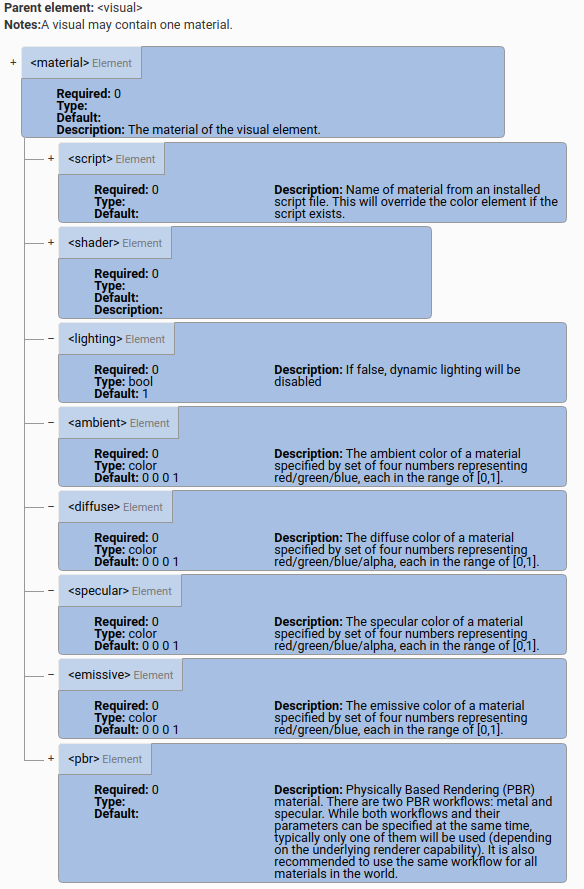
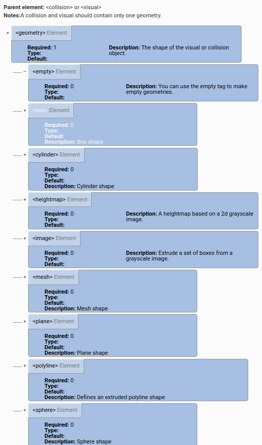

<center><font size=7>Gazebo_04_SDF</font></center>

[toc]


# Root SDFormat element

http://sdformat.org/spec?ver=1.7&elem=sdf#_sdf


- 蓝色表示元素，绿色表示属性，+号表示有子元素等，-号表示没有子元素等，>号表示定义在另一个标签里的元素。


- 如上，sdf元素下最少需要有一个version属性，其他四项可以有>=0个，即有如下可能：

  ```xml
  <?xml version='1.0'?>
  <sdf version='1.7'>
    <world name='default'>
      ...
    </world>
  </sdf>
  
  or
  
  <?xml version='1.0'?>
  <sdf version='1.7'>
    <model name='my_model'>
      ...
    </model>
  </sdf>
  
  or 
  
  <?xml version='1.0'?>
  <sdf version='1.7'>
    <actor name='my_actor'>
      ...
    </actor>
  </sdf>
  
  or
  
  <?xml version='1.0'?>
  <sdf version='1.7'>
    <light name='my_light'>
      ...
    </light>
  </sdf>
  ```

## world元素


- 一个SDF文件里面可以包含多个world元素，
- world元素一定会有一个name属性，其他的基本也是可选的

```xml
<?xml version="1.0" ?>
<sdf version="1.5">
  <world name="default">
    <include>
    	<uri>model://model/model.sdf</uri>
    </include>
    <physics type="ode">
      ...
    </physics>
    
    <scene>
      ...
    </scene>

    <model name="box">
      ...
    </model>

    <model name="sphere">
      ...
    </model>

    <light name="spotlight">
      ...
    </light>

  </world>
</sdf>
```


## Scene


## State


## Physics


## Light


## Actor


## Model


### ` <include>`


### `<pose>`


---


---

### `<gripper>`


## Link


## Sensor


## Joint

#### 总览


---


> `<joint>`
>
> 一个关节连接两个具有运动学和动力学性质的连杆。默认情况下，关节的姿态在子链接框中表示。


> `<axis>`的`<xyz>`元素，必须要有，且：
>
> 表示轴单位向量的x，y，z分量。 除非在expressed_in属性中表示不同的框架，否则轴在关节框架中表示。 向量应归一化。
>
> 对于`<limit>`元素，必须要有上下限，对移动关节单位是m，旋转关节为弧度。

## Collision



> name 属性：父链接范围内碰撞元素的唯一名称。


## Visual



---

## material



## geometry



---

# —Tutorials—分隔符

http://sdformat.org/tutorials?

# pose

http://sdformat.org/tutorials?tut=specify_pose

## Specifying pose in SDFormat

> Throughout the documentation, the suffix `_A` is used to indicate a kinematic quantity that is expressed w.r.t (with respect to) frame `A`. 
>
> 在整个文档中，后缀`_A`用于表示相对于框架A表示的运动量。 
>
> In addition, the suffix `_BA` is used to indicate a kinematic quantity that changes from being expressed w.r.t frame `A` to being expressed w.r.t frame `B`. 
>
> 此外，后缀`_BA`用于表示从框架A表示的运动量变为所表示的运动量。 
>
> For example, the pose of frame `A` expressed w.r.t frame `B` is given by the transform `X_BA` ∈ SE(3). 
>
> 例如，通过变换X_BA∈SE（3）给出了在帧B处表示的帧A的姿态。
>
> An alternative description of `X_BA` alludes to `X` being a linear operator that transforms a frame that is coincident to frame `B` to being coincident to frame`A`. In this sense,`X_BA` is said to be "the transform from B to A". Note that both descriptions are valid interpretations of the same mathematical object.
>
> X_BA的另一种描述暗指X是**将与框架B重合的框架变换为与框架A重合**的线性运算符。 从这个意义上讲，X_BA被称为“从B到A的转换”。 注意，这两种描述都是对同一数学对象的有效解释。
>
> The SDFormat specification has the ``<pose>`` element which accepts 6 numbers in total to represent a coordinate transform `X_PC` from parent frame `P` to child frame `C`:
>
> SDFormat规范具有<pose>元素，该元素总共接受6个数字，以表示从父框架P到子框架C的坐标转换X_PC：
>
> ```xml
> <pose>x y z roll pitch yaw</pose>
> ```
>
> The elements `x y z` specify the position vector (in meters), and the elements `roll pitch yaw` are Euler angles (in radians) that specify the orientation, which can be computed by an extrinsic X-Y-Z rotation as shown by the following equation for the rotation matrix `R_PC` and figure:
>
> x, y, z指明位置（单位是m）， roll, pitch, yaw(RPY), 是欧拉角指定方向的方式，单位是rad弧度，可以通过外xyz旋转计算得到。如下的旋转矩阵和图所示（

$$
R_{PC}=\left[
\begin{array}{c}
\cos(yaw) &-\sin(yaw) & 0 \\
\sin(yaw) & \cos(yaw) & 0 \\
   0      & 0         & 1 
\end{array}
\right]*
\left[
\begin{array}{c}
\cos(pitch) & 0 & \sin(pitch) \\
0 & 1 & 0 \\
-\sin(pitch) & 0 & \cos(pitch)
\end{array}
\right]*
\left[
\begin{array}{c}
1 & 0 & 0 \\
0 & \cos(roll) & -\sin(roll) \\
0 & \sin(roll) & \cos(roll)
\end{array}
\right].
$$


$$
R_{PC}=\left[
\begin{matrix}
\cos(yaw) &-\sin(yaw) & 0 \\
\sin(yaw) & \cos(yaw) & 0 \\
   0      & 0         & 1 
\end{matrix}
\right]*
\left[
\begin{matrix}
\cos(pitch) & 0 & \sin(pitch) \\
0 & 1 & 0 \\
-\sin(pitch) & 0 & \cos(pitch)
\end{matrix}
\right]*
\left[
\begin{matrix}
1 & 0 & 0 \\
0 & \cos(roll) & -\sin(roll) \\
0 & \sin(roll) & \cos(roll)
\end{matrix}
\right].
$$


- Pose Frame Semantics

http://sdformat.org/tutorials?tut=pose_frame_semantics

 semantic，语义

## Legacy behavior

> In version 1.4 and earlier of the SDF spec, the `<pose>` element represents a relative coordinate transformation between a frame and its parent. Link frames were always defined relative to a model frame and joint frames relative to their child link frames.
>
> 在版本1.4和更早的SDF规范中，``<pose>``元素表示框架及其父框架之间的相对坐标变换。链接框架始终相对于模型框架定义，而关节框架则相对于其子链接框架定义。

> In version 1.5 of the SDF spec, the `frame` attribute string was added to `<pose>` elements to allow poses to be defined relative to a named frame instead of the default frames from version 1.4. For example, this would allow an SDF model to define its kinematics like a URDF, with joint frames defined relative to the parent link frame and a joint's child link frames relative to the joint frame.
>
> The 1.5 specification also adds `<frame>` elements which can define named coordinate frames in addition to the existing link and joint frames in the model.
>
> 在 SDF 规范的1.5版本中，框架属性字符串被添加到姿态元素中，以允许相对于命名的框架定义姿态，而不是1.4版本的默认框架。 例如，这将允许 SDF 模型像 URDF 一样定义其运动学，关节框架相对于父链接框架定义，关节的子链接框架相对于关节框架定义。
>
> 1.5规范还添加了``<frame>``元素，该元素除了可以定义模型中现有的链接框架和关节框架之外，还可以定义命名的坐标框架。

## Element naming rules in sdf 1.4

> In sdf 1.4, sibling elements of the same type must have unique names. For example, the following models are invalid because links, joints, and collisions with the same parent do not have unique names.
>
> 在==SDF1.4====中，**相同类型**的**同级元素**必须具有**唯一的名称**，下面的两种情况情况都是错误的。
>
> > ```xml
> > 1.
> > <sdf version="1.4">
> >   <model name="model">
> >     <link name="link"/>
> >     <link name="link"/> <!-- INVALID: Same name as sibling "link"! -->
> >   </model>
> > </sdf>
> > 2.
> > <sdf version="1.4">
> >   <model name="model">
> >     <link name="link1"/>
> >     <link name="link2"/>
> >     <link name="link3"/>
> >     <joint name="joint" type="fixed">
> >       <parent>link1</parent>
> >       <child>link2</child>
> >     </joint>
> >     <joint name="joint" type="fixed"> <!-- INVALID: Same name as sibling "joint"! -->
> >       <parent>link2</parent>
> >       <child>link3</child>
> >     </joint>
> >   </model>
> > </sdf>
> > ```
> >
> > 如下，同级元素（link和joint），不同类型，可以重名，但是不推荐
> >
> > ```xml
> > <sdf version="1.4">
> >   <model name="model">
> >     <link name="base"/>
> >     <link name="attachment"/>
> >     <joint name="attachment" type="fixed"> <!-- VALID, but RECOMMEND AGAINST -->
> >       <parent>base</parent>
> >       <child>attachment</child>
> >     </joint>
> >   </model>
> > </sdf>
> > ```
> >
> > 如下，允许创建一个名为world的链接（link），但是对于在<parent>或<child>标签中指定的world的关节（joint）有特殊处理，因此不建议这样做。
> >
> > ```xml
> > <sdf version="1.4">
> >   <model name="model">
> >     <link name="world"/> <!-- VALID, but RECOMMEND AGAINST -->
> >     <link name="world_link"/> <!-- VALID, better -->
> >   </model>
> > </sdf>
> > ```

---

## Parent frames in sdf 1.4

> > With the exception of joint frames, all `<pose>` tags in sdf 1.4 define a relative transform between the current element's frame and the frame of its parent xml element.
>
> 除了关节（joint）框架外，sdf 1.4中的所有``<pose>``标记都定义了当前元素的框架与其父xml元素的框架之间的相对转换。
>
> > the link frame is defined relative to the model frame, and the inertial, collision, visual, and sensor frames are all defined relative to the link frame.
>
> 例如，在下面的模型中，
>
> - 链接(link)框架是相对于模型(model)框架定义的
>
> (即link的`pose`是在model的`pose`的基础上进行定义的，对应的link中的pose的值是相对model这个坐标系下的pose值)
>
> - 惯性、碰撞、视觉和传感器等框架都是相对于链接(link)框架定义的。
>
> （即是在已经定义好的link坐标系下的pose值）
>
> ```xml
> <sdf version="1.4">
>   <model name="model">
>     <pose>...</pose>
>     <link name="link">
>       <pose>...</pose>
>       <inertial>
>         <pose>...</pose>
>       </inertial>
>       <collision name="collision">
>         <pose>...</pose>
>       </collision>
>       <visual name="visual">
>         <pose>...</pose>
>       </visual>
>       <sensor name="sensor">
>         <pose>...</pose>
>       </sensor>
>     </link>
>   </model>
> </sdf>
> ```
>
> ---
>
> 上面的代码等价于如下的sdf1.5以上的代码(只是在pose标签中加入frame属性为空)
>
> ```xml
> <sdf version="1.5">
>   <model name="model">
>     <pose frame=''>...</pose>
>     <link name="link">
>       <pose frame=''>...</pose>
>       <inertial>
>         <pose frame=''>...</pose>
>       </inertial>
>       <collision name="collision">
>         <pose frame=''>...</pose>
>       </collision>
>       <visual name="visual">
>         <pose frame=''>...</pose>
>       </visual>
>       <sensor name="sensor">
>         <pose frame=''>...</pose>
>       </sensor>
>     </link>
>   </model>
> </sdf>
> ```
>
> ---
>
> > The one exception is the joint frame, which is defined relative to the child link frame. In the following example, the joint frame is defined relative to the link frame of `link2`.
>
> ​	一个例外是关节框架，它是相对于子链接框架定义的（由以下三句可得：
>
> ```xml
>       <pose>...</pose>
>       <parent>link1</parent>
>       <child>link2</child>  
> 			<!--这里指明了子链接框架为link2，就对应说明了这个joint框架是相对于link2定义的-->
> ```
>
> ）。 在以下示例中，joint框架是相对于link2的链接框架定义的。
>
> ```xml
> <sdf version="1.4">
>   <model name="model">
>     <pose>...</pose>
>     <link name="link1">
>       <pose>...</pose>
>     </link>
>     <link name="link2">
>       <pose>...</pose>
>     </link>
>     <joint name="joint" type="fixed">
>       <pose>...</pose>
>       <parent>link1</parent>
>       <child>link2</child>
>     </joint>
>   </model>
> </sdf>
> ```

等价于sdf1.5以上的版本代码如下(只是在pose标签中加入frame属性为空)

```xml
<sdf version="1.5">
  <model name="model">
    <pose frame=''>...</pose>
    <link name="link1">
      <pose frame=''>...</pose>
    </link>
    <link name="link2">
      <pose frame=''>...</pose>
    </link>
    <joint name="joint" type="fixed">
      <pose frame=''>...</pose>
      <parent>link1</parent>
      <child>link2</child>
    </joint>
  </model>
</sdf>
```

## Parent frames in URDF

http://wiki.ros.org/urdf

http://wiki.ros.org/urdf/XML

[URDF documentation](http://wiki.ros.org/urdf/XML/model) 

Unified Robot Description Format ([URDF](http://wiki.ros.org/urdf/XML/model)) 机器人统一描述格式

> A URDF file contains links, joints, collisions, visuals, and inertials like SDFormat, but with several significant differences.
>
> 既像sdf，又有所差别

1. 使用`<origin/>`标签代替`<pose/>`标签，如：

```xml
<pose>x y z roll pitch yaw</pose>
```

is equivalent to

```xml
<!-- URDF -->
<origin rpy='roll pitch yaw' xyz='x y z'/>
```

2. link和robots（相当于原来的model）没有`<origin>`标签

> Similar to SDFormat, URDF inertial, collision, and visual elements are defined relative to their parent link frame with their own `` tag, but links and robots (equivalent to models) do not have `` tags:

```xml
<sdf version="1.4">
  <model name="model">
    <link name="link">
      <inertial>
        <pose>...</pose>
      </inertial>
      <collision name="collision">
        <pose>...</pose>
      </collision>
      <visual name="visual">
        <pose>...</pose>
      </visual>
    </link>
  </model>
</sdf>
```

is equivalent to

```xml
<!-- URDF -->
<robot name="model">
  <link name="link">
    <inertial>
      <origin rpy='...' xyz='...'/>
    </inertial>
    <collision name="collision">
      <origin rpy='...' xyz='...'/>
    </collision>
    <visual name="visual">
      <origin rpy='...' xyz='...'/>
    </visual>
  </link>
</robot>
```

> The most significant difference between URDF and SDFormat coordinate frames is related to links and joints. While SDFormat allows kinematic loops with the topology of a directed graph, URDF kinematics must have the topology of a directed tree, with each link being the child of at most one joint. URDF coordinate frames are defined recursively based on this tree structure, with each joint's `<origin/>` tag defining the coordinate transformation from the parent link frame to the child link frame.

​	URDF和SDFormat坐标系最显著的区别在于链接和关节，SDF格式允许运动回路具有有向图的拓扑结构，而Urdf 运动学必须具有有向树的拓扑结构，每个链接最多是一个关节的子链接。URDF坐标系是基于此树结构递归定义的，每个关节的`<origin/>`标签定义了从父链接框架到子链接框架的坐标转换。

因而有

```xml
<sdf version="1.4">
  <model name="model">
    <link name="link1"/>
    <link name="link2"/>
    <joint name="joint" type="fixed">
      <pose>{xyz} {rpy}</pose>
      <parent>link1</parent>
      <child>link2</child>
    </joint>
  </model>
</sdf>
```

is decidedly not equivalent to（肯定不等于）

```xml
<!-- URDF -->
<robot name="model">
  <link name="link1"/>
  <link name="link2"/>
  <joint name="joint" type="fixed">
    <origin xyz='{xyz}' rpy='{rpy}'/>
    <parent link="link1"/>
    <child link="link2"/>
  </joint>
</robot>
```

